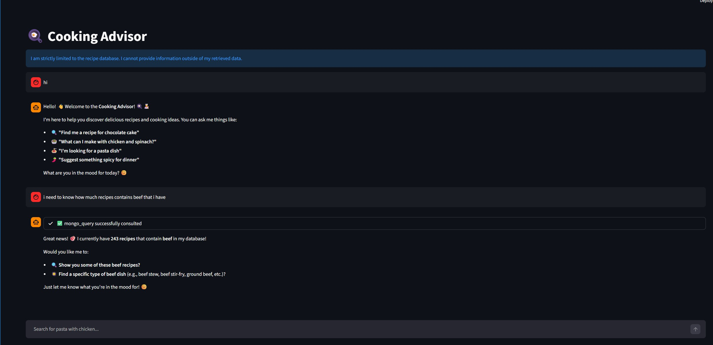
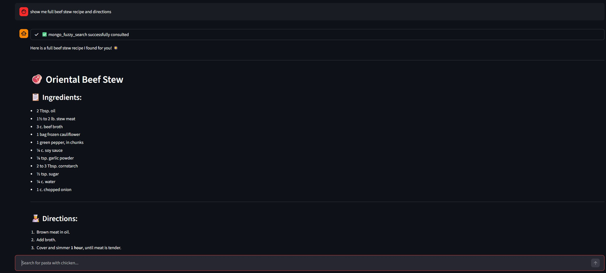
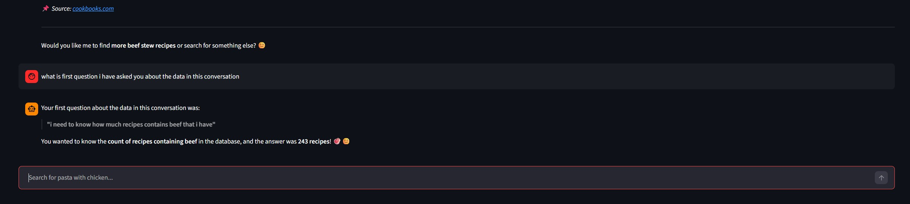

# Cooking Advisor

Cooking Advisor is an AI-powered conversational assistant that combines the reasoning capabilities of Anthropic's Claude with structured, vector, and fuzzy search tools via MongoDB Atlas. It runs using the Model Context Protocol (MCP) to cleanly separate generative logic from database operations.

## Screenshots

<div align="center">
  <br>
  <br>
  
</div>

## Prerequisites

Before running the application, you **must** have the following installed and configured:

1. **Ollama**: Required for computing local text embeddings.
   * After installing Ollama, you must download the specific embedding model:
     ```bash
     ollama pull bge-m3
     ```
2. **uv**: Used as the fast Python runner for the MCP server.
   * E.g., The system runs `uv run MCP/server.py` in the background to spin up the local tool server safely.
3. **Anthropic API Key**: Required for Claude (the underlying generative AI agent).
4. **MongoDB URI**: Connection string to your MongoDB Atlas cluster containing the `cooking` database and `recipes` collection. (The cluster must have the appropriate Vector Search and Text Search indices configured).

## Environment Variables

Create a `.env` file in the root directory of the project and add your credentials:

```env
ANTHROPIC_API_KEY=your-anthropic-api-key-here
MONGO_URI=mongodb+srv://<username>:<password>@<cluster>.mongodb.net/?retryWrites=true&w=majority
```

## Installation

Ensure your Python environment is active, then install the required dependencies (using `pip` or `uv pip`):

```bash
pip install -r requirements.txt
```

## How to Use

The application provides two distinct operational interfaces.

### 1. Streamlit Web Application (Recommended)
You can run the interactive UI, which automatically spawns the MCP tool server in the background and connects to it natively.

```bash
streamlit run demo.py
```

### 2. Terminal Client
If you prefer a purely command-line interface, you can run the terminal MCP client. It operates identically to the web app, allowing you to converse with the system via the console:

```bash
uv run MCP/client.py
```

## Data Ingestion & Exploration
If you need to re-index the raw recipe data or explore the dataset properties, please refer to the Jupyter notebooks included in the `notebooks/` directory:
- `notebooks/recipes_data_ingestion.ipynb` (Demonstrates MongoDB document creation and semantic embedding)
- `notebooks/recipes_data_explore.ipynb`
